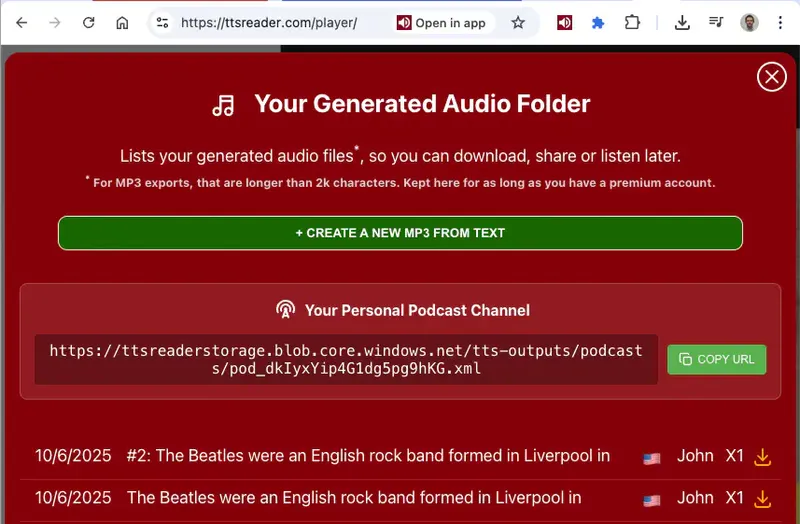

*By Amiel | Jan 11, 2026*

Starting a podcast has always come with a checklist of barriers. You need a good microphone, quiet recording space, audio editing software, and a hosting service to manage your RSS feed. We looked at that list and asked a simple question: "What if all you needed was something to say?"

As a developer, I get to see the creative ways people use our tools. I noticed a pattern: users were diligently exporting MP3s of their work, but that was just the beginning of their journey. They were then taking those files to other platforms, manually uploading them, and wrestling with complicated hosting services just to share their content as a podcast. It felt like we had only given them half a bridge. That's when the idea hit us. We could build the rest of that bridge for them. The mission became clear: **if you can write, you should be able to podcast.**

### From Text to Global Distribution: The Technical Story

Building a true podcasting feature meant solving more than just audio creation. The heart of any podcast is its RSS feed—a specially formatted XML file that platforms like Spotify and Apple Podcasts use to find and display episodes. Our challenge was to automate the creation and management of this feed.

Here's the workflow we built:

1.  **Channel Creation:** When you create a new podcast channel in TTSReader, we do more than just save the name and description. We provision a unique, persistent URL that will host your personal RSS feed.
2.  **Episode Synthesis:** When you add a new episode, you're kicking off a two-part backend process. First, our engine synthesizes your text into a high-quality MP3 file, just like our export feature.
3.  **Automated RSS Update:** Here's the magic. Once the MP3 is ready, our system automatically updates your channel's RSS feed. It adds a new `<item>` (the episode), populates it with your title and description, and writes the URL of the new MP3 into the `<enclosure>` tag.

This means your RSS feed is always up-to-date. The moment you create an episode, it's live and ready for podcast platforms to discover. There's no need to manage XML files or deal with a separate hosting service.

### Podcasting in the Real World

This automated pipeline has opened up podcasting to a whole new group of creators.

*   **The Blogger:** A writer who has spent years building a blog can now repurpose their entire archive. By turning their most popular posts into episodes, they can reach a new audience that prefers listening over reading, with minimal extra effort.
*   **The Small Business:** A marketing team can produce a weekly "industry news" podcast. They gather interesting articles, write a short script, and generate a professional-sounding podcast in under an hour, establishing their brand as an authority in their field.
*   **The Educator:** A history teacher can turn their lesson plans for each week into a podcast series. Students can subscribe and listen to the material before class, during their commute, or as a review tool for exams, making learning more accessible and flexible.

We believe that great ideas deserve to be heard. By removing the technical hurdles, we've turned TTSReader into more than just a text-to-speech tool; it's a publishing platform.

For a detailed walkthrough on setting up your channel, check out our **[Official Guide to Creating a Podcast](https://ttsreader.com/docs/guides/create-podcasts/)**.

