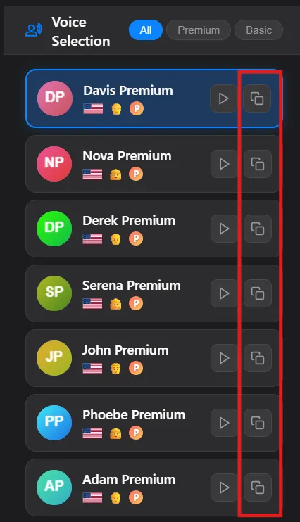
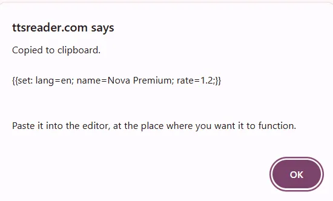

One of the most powerful applications of our synthesis control codes is the creation of multi-voice dialogues from a single text file. This guide provides a practical, step-by-step walkthrough of how to use the `{{set}}` code to assign different voices to different characters in a script.

This technique allows you to produce complex, conversational audio without any post-processing or audio editing.

## The Core Technique: Scripting with `{{set}}`

The fundamental principle is to insert a `{{set}}` code before each piece of dialogue to switch the active voice to the desired character.

The workflow is as follows:
1.  Write the complete dialogue in the [TTSReader player](https://ttsreader.com/player/).
2.  For each character in your dialogue, select the desired voice and settings in the player's voice selection menu.
3.  Use the "copy" button to get the full `{{set:...}}` code for that specific voice configuration.
4.  Paste this code directly into your text before the character's line.

## Step-by-Step Example

Let's convert a simple two-person script into a multi-voice audio file.

### Step 1: The Plain Text Script

First, write your script with clear character labels.

```
Is the new system deployed?

Yes, it went live this morning.

Any issues reported?

Just one minor bug. I'm working on a patch now.
```

### Step 2: Assigning Voices

Now, we will assign voices to Nova and Davis.

1.  In the TTSReader player, choose a voice for Nova. Use the copy button to get the code.
2.  Choose a different voice for Davis. Copy his code as well.

The codes will look like this (your specific codes may vary):
*   **Davis's Code:** `{{set: lang=en; name=Davis Premium; rate=1.2;}}`
*   **Nova's Code:** `{{set: lang=en; name=Nova Premium; rate=1.2;}}`

### Step 3: Assembling the Final Text

Finally, insert these codes into your script. It's also good practice to remove the character labels and add `{{pause}}` codes for more natural pacing.

```

{{set: lang=en; name=Nova Premium; rate=1.2;}}
Is the new system deployed?

{{pause:1000}}

{{set: lang=en; name=Davis Premium; rate=1.2;}}
Yes, it went live this morning.

{{pause:800}}

{{set: lang=en; name=Nova Premium; rate=1.2;}}
Any issues reported?

{{pause:1000}}

{{set: lang=en; name=Davis Premium; rate=1.2;}}
Just one minor bug. I'm working on a patch now.
```

When you play this text, the TTS engine will automatically switch between the voices for Davis and Nova, creating a natural-sounding dialogue.

## Use Cases

*   **E-Learning & Training:** Create engaging, scenario-based training modules that simulate real-world conversations between employees and customers.
*   **Screenwriting & Storytelling:** Bring scripts to life by assigning unique voices to each character, allowing writers to preview how their dialogue flows.
*   **Game Development:** Rapidly prototype in-game conversations and narrative sequences without needing to hire voice actors for early builds.
*   **Language Learning:** Many of our users create custom audios that contain a sentence in one language - and then the translated sentence in another language. This is a great way to learn a new language.

This technique provides a powerful and efficient method for producing high-quality, multi-speaker & multi-lingual audio directly from any text.

