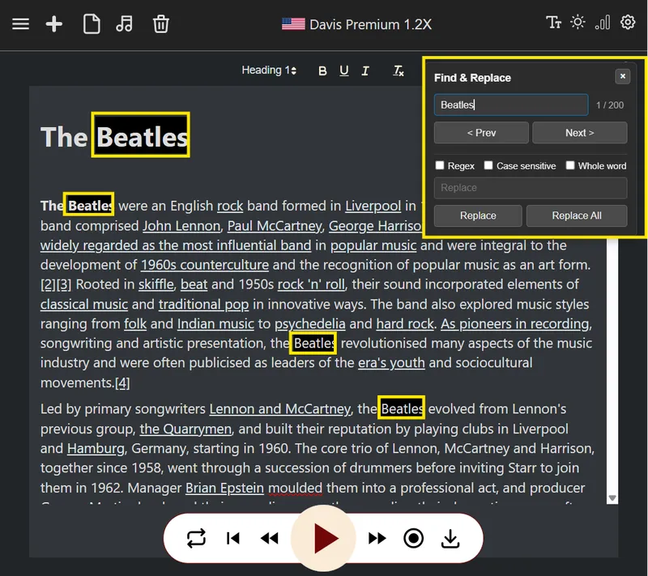

The Find & Replace tool is a classic, powerful utility with a specific role in our platform.

It also supports regular expressions, REGEX - which are a powerful tool for text manipulation. For example, you can find and replace all occurrences of the structure "[ Some text ]". And more.

Also supports full-words search, and case-sensitive search.

Find & Replace is a small tool that does a big job. It’s about giving you the power to perfect your text, so you can create perfect audio.

