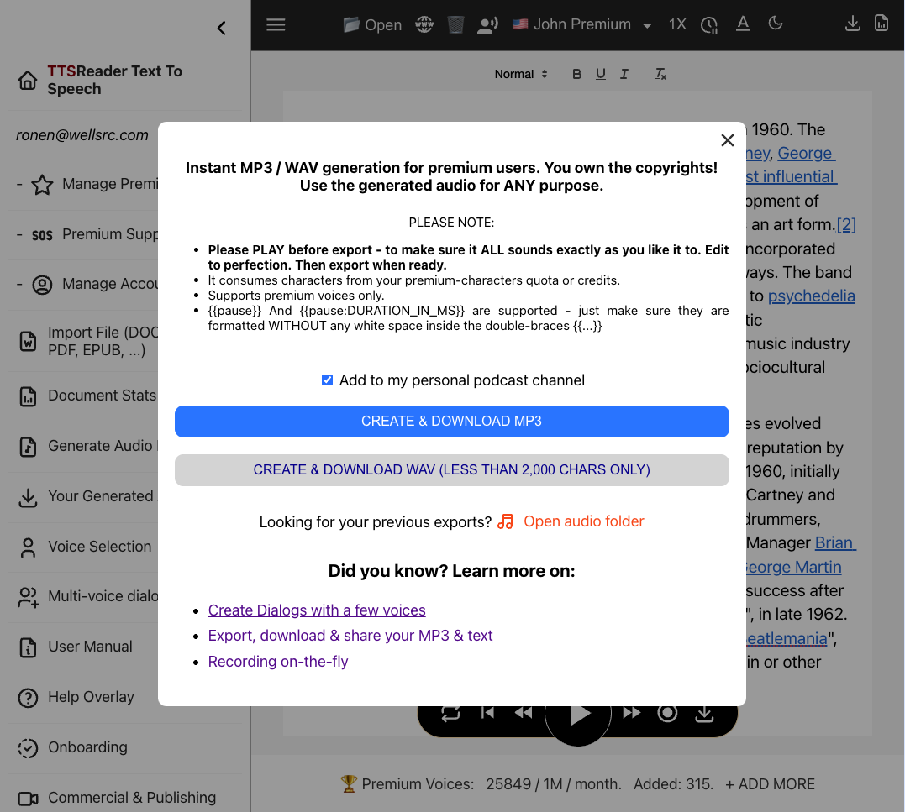

## Introduction

TTSReader's player at [https://ttsreader.com/player/](https://ttsreader.com/player/) allows you to convert any text into speech and create your own personal podcast channel. You can then import this channel into popular podcast apps like Apple's Podcasts, Google Podcasts, and more. This guide will walk you through the process step by step.

## Step 1: Create Your Podcast Channel with TTSReader

1. **Access the TTSReader Player**: Go to [https://ttsreader.com/player/](https://ttsreader.com/player/) in your web browser.

2. **Prepare Your Content**: Enter the text you want to convert to speech. TTSReader supports various input methods including pasting text, uploading files, or entering URLs.

3. **Enable Podcast Export**: Before generating the audio, make sure to check the "Add to Podcast" option. This will make your generated audio available as a podcast episode.

   

4. **Generate and Export**: Click the "Export MP3" button to create your audio file. TTSReader will process your text and generate the speech audio.

5. **Copy the Podcast URL**: After export, you'll see a podcast URL. Copy this URL, as you'll need it to subscribe in your podcast app.

   

Your personal podcast channel is now created! Each time you export new content with the "Add to Podcast" option checked, it will be added as a new episode to your channel.

## Step 2: Import Your Podcast into Apple's Podcasts App

The following steps demonstrate how to import your TTSReader podcast channel into Apple's Podcasts app. Note that the process is similar for other podcast apps like Google Podcasts, Pocket Casts, and more.

1. **Open the Podcasts App**: Launch the Podcasts app on your iPhone, iPad, or Mac.

2. **Go to Your Library**: Tap on the "Library" tab at the bottom of the screen.

   

3. **Access the Follow Menu**: Tap the menu button (three dots) in the top-right corner, then select "Follow a Show by URL".

   

4. **Paste the URL**: Paste the podcast URL you copied from TTSReader into the URL field, then tap "Follow".

   

5. **View Your Followed Shows**: Your TTSReader podcast channel will now appear in your Library under "Shows".

   

6. **Browse Episodes**: Tap on your podcast show to see all available episodes.

   

7. **Play an Episode**: Tap on any episode to start playing it.

   

8. **Background Playback**: The podcast will continue playing even when the screen is locked or you're using other apps.

   

## Tips and Notes

- **Multiple Episodes**: Each time you export new content from TTSReader with "Add to Podcast" enabled, it becomes a new episode in your channel.
- **RSS Feed**: The URL you copy is an RSS feed URL that any podcast app can subscribe to.
- **Privacy**: Your podcast episodes are generated on-demand and stored on our server with public access, so they can be available to the podcasts apps. If your content is sensitive - it's recommended NOT to add it to your podcast channel - as it may be indexed by the 3rd party apps playing your podcast.
- **Publish**: You can share and publish your channel so others can enjoy. For example - if you are a teacher - you can create a channel for your classroom. Share with co-workers, friends, family and more.
- **Customization**: You can customize the voice, speed, and other settings in TTSReader before exporting.
- **Cross-Platform**: The same podcast URL works across all devices and podcast apps that support RSS feeds.

Now you can enjoy your personalized text-to-speech content anywhere, just like a regular podcast!
