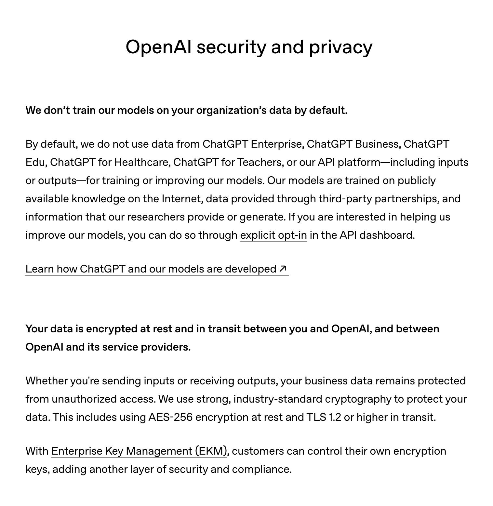

 

## General

We at TTSReader value your privacy, and that's why we do not store anything you say or type or in fact any other data about you - unless it is solely needed for the purpose of your operation. We don't share it with 3rd parties, other than what is minimally necessary in order for the service to work. That includes:

* Sending text to generate speech to world-leading voice providers, such as: Google / Microsoft / OpenAI / ElevenLabs. In any such case, the text is sent in a secure manner, without any information about the user, and in under the condition / terms that the voice provider caanot use the text for any other purpose than generating the speech and returning it to us. We do not use the text for training or improving our models, and we do not allow the voice providers to use it for training or improving their models. View the specific terms of our leading subcontractors in the section below: [Privacy Policies of Third-Party Providers](#privacy-policies-of-third-party-providers).
* Sending text to your own browser's text-to-speech API - via the Web Speech API - which is a standard API implemented by modern browsers. This API is used to generate speech for the non-premium voices. When using these non-premium voices (basic voices), privacy terms by your browser and operating system apply, as the speech is generated through the browser and operating system's built-in text-to-speech capabilities.
* Retaining Data - we only retain your text or generated speech to serve you:
  * Local retention - data is stored in your browser's local storage, so you can access it later from the point you left off.
  * Server retention - data is stored on our servers only if you choose to export you text to MP3. In that case - the text and the generated audio are stored on our servers, without any personal information or link to you. They are only accessible via a unique link, which is visible only to you - unless you decide to share it. To keep your exported text & audio private - simply do not share the link. We're working these days to add a 'remove' button, so you can remove the exported text and audio from our servers whenever you want.
* Payment processors: sharing data with PayPal, Stripe, Paddle or potentially other payment-processor provider for payment processing.
* Sharing data with Google or other cloud service providers for cloud-syncing your text, only if you choose to do so.
* Sharing data with accountants or lawyers or other service providers for the purpose of running our business, and only if absolutely necessary.
* Sharing data with our trusted developers for the purpose of development, and only if absolutely necessary.
* Sharing data with law enforcement or other authorities if we are required to do so by law, or if we believe in good faith that such action is necessary to comply with the law, protect our rights or property, or protect the safety of our users or the public.
* Numerous developers may have access to your account, including exported text and audio (only if 'export to MP3 was used' and not removed ), and other data, but they are all trusted developers, and they are all instructed by our regulations to not view user&rsquo;s texts without a specific need for development purpose or without user&rsquo;s consent. To further protect your privacy from mistakes, all your texts are stored in such a matter that they do not contain your name or email, but only your user id.
* Users' private data will never be sold to 3rd parties, and will not be used for anything other than user support. Having said that, in case TTSReader or its owner company will be sold to a buying company, we will transfer users' data with the product in order to keep it working through the ownership transition. In such a case we will notify registered users via email and give you time to remove your account before the transition if you so choose.
 

## Data Privacy and Security
### Customer Data Ownership
Users retain all rights, title, and interest in the text, content, and data they provide to the service ("Customer Data"). TTSReader does not claim ownership of such content.
 

### Use of Customer Data
Customer Data is processed solely for the purpose of providing, maintaining, and supporting the TTSReader services, including operational purposes such as security monitoring, troubleshooting, and service reliability.
We do not sell Customer Data to third parties.
 

### AI / Machine Learning Usage
TTSReader does not use customer text or content to train or improve machine-learning or artificial-intelligence models belonging to TTSReader or third parties.
 

### Security Incident Notification
If we become aware of a confirmed security incident that materially compromises the confidentiality, integrity, or availability of stored user data, we will notify affected users without undue delay and take reasonable steps to investigate and mitigate the issue.
 

## Updates to this Privacy Policy

As we keep developing our service, adding new features and adapting it to environment changes, technical changes, legal changes, and other changes, we may update this Privacy Policy from time to time. We will notify you of any changes by posting the new Privacy Policy on our website. You are advised to review this Privacy Policy periodically for any changes.

 

## More generic notes regarding our site, cookies, analytics, ads, etc.</h2>

<ul>
  <li>We may use Google Analytics on our site - which is a generic tool to track usage statistics.</li>
  <li>We use cookies - which means we save data on your browser to send to our servers when needed. This is used for instance to sign you in, and then keep you signed in.</li>
  <li>We use your browser's local storage to store your texts, so you can access it later from the point you left off.</li>
  <li>We may serve ads by Google's AdSense (although we currently don't serve ads on our main player at https://ttsreader.com/player/ . Users may opt out of personalized advertising by visiting <a href="https://www.google.com/settings/ads" target="_blank" rel="nofollow">Ads Settings</a>. Alternatively, users can opt out of a third-party vendor's use of cookies for personalized advertising by visiting <a href="https://youradchoices.com/" target="_blank" rel="nofollow">https://youradchoices.com/</a></li>
</ul>
 
 
<h3 id="general---your-text-data">General - Your Text Data & Exported Audio</h3>
<ul>
<li>We very much respect your privacy.</li>
<li>Text sent to long-text-export, and its respective resulting audio file are stored on our server and are publicly accessible to anyone with the link. How are they kept private? The link itself has a coded password, which is visible only to you - unless you decide to share it. To keep your exported text & audio private - simply do not share the link.</li>
<li>If you sign in, and choose to cloud-sync your text, then it is being stored on Google&rsquo;s Firebase database service, following their best practices to secure your data privately. No other users can access your data.</li>
</ul>
 
<h4 id="our-developers">Our Developers &amp; Team Regulations</h4>

Only our most trusted developers have access to our databases.

 
Even the most trusted developers are instructed by our regulations:
<ul>
<li>
<ul>
<li>Not to view user&rsquo;s texts without a specific need for development purpose or without user&rsquo;s consent.</li>
</ul>
</li>
<li>
<ul>
<li>To further protect your privacy from mistakes, all your texts are stored in such a matter that they do not contain your name or email, but only your user id.</li>
</ul>
</li>
<li>
<ul>
<li>Users' private data will never be sold to 3rd parties, and will not be used for anything other than user support or development. Having said that, in case TTSReader or its owner company will be sold to a buying company, we will transfer users' data with the product in order to keep it working through the ownership transition. In such a case we will notify registered users via email and give you time to remove your account before the transition if you so choose.</li>
</ul>
</li>
</ul>

  

<h4 id="our-servers">Our Servers</h4>

We use Google / Azure / AWS servers both for the logic and for saving the data.
We do our best to follow their guidelines for securing your private data, but, we cannot insure against data leaks or theft by either a technical mistake by us or by malicious attacks on our servers in form of hacking or unintended use or other.

  

<h4 id="no-warranty">No Warranty</h4>

We do our best to follow best security practices to protect our servers and your data, but, we cannot insure against data leaks or theft by either a technical mistake by us or by malicious attacks on our servers in form of hacking or unintended use or other.
To minimize the risk in all cases - we do not gather or keep any information that we do not explicitly need for the app to operate or for collecting general analytics.

 
 
<h3 id="web-specific-in-addition-to-the-general-clause">Web Specific (in addition to the General clause)</h3>
<ul>
<li>We use your local storage to save your latest data from session to session, so it won&rsquo;t get lost when you leave the website.</li>
<li>We use targeted advertising by Google and other vendors, managed by Google directly or by Google-certified vendors.</li>
</ul>
 
<h4 id="targeted-ads">Targeted Ads</h4>
<ul>
<li>Third party vendors, including Google, use cookies to serve ads based on a user&rsquo;s prior visits to your website or other websites.</li>
<li>Google&rsquo;s use of advertising cookies enables it and its partners to serve ads to your users based on their visit to your sites and/or other sites on the Internet.</li>
<li>Users may opt out of personalized advertising by visiting Ads Settings. (Alternatively, you can direct users to opt out of a third-party vendor&rsquo;s use of cookies for personalized advertising by visiting <a href="http://www.aboutads.info">www.aboutads.info</a>.)</li>
</ul>

  

<h3 id="android-app-specific-in-addition-to-the-general-clause">Android App Specific (in addition to the General clause)</h3>
<ul>
<li>We use AdMob by Google for targeted ads. Admob uses your <a href="https://play.google.com/about/monetization-ads/ads/ad-id/">Android Ads ID</a>.</li>
</ul>

   

<h2 id="terms-of-use">Terms of Use</h2>

The product is licensed for use and not sold. The service is provided "as is" and "as available", without warranties of any kind, whether express or implied. Use of the service is at your own risk. To the maximum extent permitted by law, TTSReader shall not be liable for damages arising from the use or inability to use the service.

For commercial terms and copyright information please see our legal pages. <a href="https://ttsreader.com/categories/legal/">our legal posts</a>.

   

## Privacy Policies of Third-Party Providers

 

Sending text to generate speech to world-leading voice providers, such as: Google / Microsoft / OpenAI / ElevenLabs. In any such case, the text is sent in a secure manner, without any information about the user, and in under the condition / terms that the voice provider caanot use the text for any other purpose than generating the speech and returning it to us. We do not use the text for training or improving our models, and we do not allow the voice providers to use it for training or improving their models. View the specific terms of our leading subcontractors in the section below:

 

* ### Google

"Google does not log any customer Cloud TTS text or audio data."

Taken on 2026-03-13 from Google's official documentation here:
[https://docs.cloud.google.com/text-to-speech/docs/data-logging](https://docs.cloud.google.com/text-to-speech/docs/data-logging)

* ### OpenAI

We of course use OpenAI's API - which is governed in their business category of data-safety. And, we of course do not let them train on your data or keep it for any reason other than generating the speech and returning it to us. For more details - see their data-safety terms here:

[OpenAI](https://openai.com/business-data/)

* ### Microsoft (Azure Speech Service and Data Storage)

[Azure Speech Service – Data Privacy and Security](https://learn.microsoft.com/en-us/azure/foundry/responsible-ai/speech-service/text-to-speech/data-privacy-security?tabs=prebuilt-voice)

[Azure Storage – Data Privacy and Security](https://azure.microsoft.com/en-us/explore/trusted-cloud/privacy)

 

## Contact us

[Contact us]() if you have any questions.

Effective Date: _1st March 2023_
Updated on: _12 March 2026_
