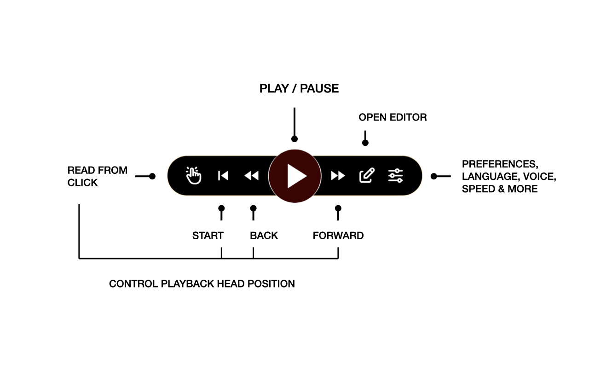
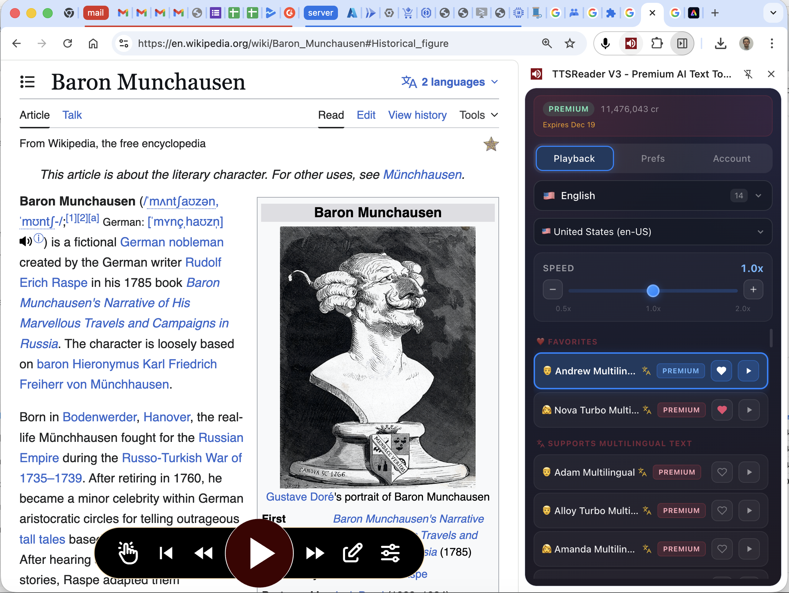
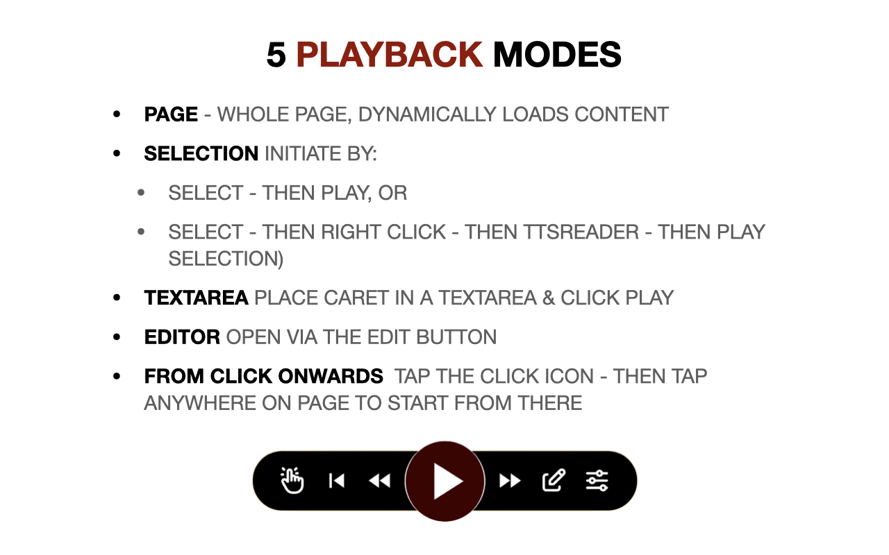

 

We are excited to launch the new **TTSReader browser extension**. Compatible with **Chrome** and **Edge**. Still working on a **Firefox** version.

## Get It Now

Install it directly from the Chrome Web Store:
<a href="https://chromewebstore.google.com/detail/kimpjeeihakmgdlnkjaapkdikpjccabi" target="_blank">Open the TTSReader extension page on the Chrome Store</a>

## Demo Video

 

  <iframe style="display: block" src="https://www.youtube.com/embed/PGtn-X4iM10?rel=0"  title="YouTube video player - Generate audio mp3 files from synthesized speech with TTSReader" frameborder="0" allow="accelerometer; autoplay; clipboard-write; encrypted-media; gyroscope; picture-in-picture" allowfullscreen=""></iframe>

 

## Sets a New Gold Standard for Browser Extensions

TTSReader is built to set a **new gold standard** for browser text-to-speech extensions.

### Privacy First - by Design

- TTSReader does NOT have access to any website unless you EXPLICITLY turn it on for that specific tab. So you can be SURE we do NOT have access to content you don't want us to.
- TTSReader does NOT PERSIST your content on our cloud, NOR TRAIN on your content. Once the audio is generated it is sent to your device and stays only there.

### Does Not Bloat or Slow Your Browsing Experience

- Off by default, so pages load normally by definition. No default injection, no default UI, no default access to any page.
- Code injection is only when you explicitly turn it ON - and even then:
  - Only after the webpage is fully loaded.
  - All our UI is overlaid on top of the page via **Shadow DOM**.
  - Lightweight by design.

## Features

1. Does not inject itself unless explicitly triggered by the user.
2. New/latest natural-sounding AI voices.
3. 600+ voices, multilingual (any supported language).
4. Adjustable reading speeds.
5. Skips irrelevant content.
6. Built-in editor so you can edit on-page text and create custom TTS playback.
7. Play selected text.
8. Play an entire page.
9. Play text inside a textarea.
10. Context menu support.
11. Play from a specific paragraph onward.
12. Read-along highlighting that follows the section currently being read.
13. Test a voice with a single click.
14. Favorite voices.
15. Unlimited playback with browser/OS-supplied voices.
16. Sends only the text needed for the next section (with a small buffer), not the whole text, to save credits and generate only what is necessary.

## Quick Start Guide

1. Install the extension from the Chrome Web Store at: <a href="https://chromewebstore.google.com/detail/kimpjeeihakmgdlnkjaapkdikpjccabi" target="_blank">https://chromewebstore.google.com/detail/kimpjeeihakmgdlnkjaapkdikpjccabi</a>
2. Pin TTSReader in the browser toolbar for one-click access.
   
3. Use the extension action button to show/hide the floating controller on any page.
   
4. Use right-click context menu actions (`Play Selection` / `Play Page`) for the fastest start.
   
5. Get to know the controller actions:
   - Play / Pause
   - Navigate Player Head Position:
     - Jump to Paragraph (awaits your click on any paragraph to jump to it)
     - Beginning of Page
     - Previous Paragraph
     - Next Paragraph
   - Open Editor (edit the text to be read, and then play it)
   - Open Preferences (language, voice, speed, prefs, account)
   
6. Use the side panel as your command center for voices, playback settings, and account status.
   
7. Choose the reader-mode that matches your task: page, selection, or textarea/editor.
   

## Is a Premium Plan Required to Use the Extension?

YES! The extension is free to install and test, but eventually requires a TTSReader Premium plan. One plan can be used across all TTSReader products: the webplayer at ttsreader.com/player/ and the extension. No need to purchase more than once.

### Why Is the Extension Not Free?

Always look for the business model. If you are not paying for the product, you are the product. We sell you our product, we do not want to turn our users into the product. We are committed to providing a high-quality product that respects your privacy and security, and we need to charge for it in order to cover development and running costs.

### Why Not Use a Free Alternative?

1) When installing a browser extension, make sure you 100% trust the developer behind it. You should be very cautious before installing ANY Chrome extension. TTSReader is developed by WellSource - a reputable company with a strong track record in the text-to-speech space since 2015. We are trusted by millions of users world wide, as well as governments, colleges, and businesses. We were selected for Microsoft-for-Startups for 2 years. We are committed to providing a high-quality product that respects your privacy and security.
2) Free alternatives often come with hidden costs, such as data collection, ads, limited functionality and even different types of malwares (3rd party-spying, ads injections, clicks hijacking). TTSReader offers a premium experience without compromising your privacy or selling you to 3rd parties.
3) Additional reasons:

- **Highest Quality**
- **Privacy-First**
- **Best-in-Class User Experience**
- **Continuous Updates and Improvements**
- **Supports Ongoing Development and Innovation**
- **WellSource - the developer behind TTSReader.com is a company you can trust with such a potentially intrusive tool as a browser extension**
- **100% Satisfaction Guarantee** - If you are not satisfied with the extension, we offer a 30-day money-back guarantee. We want you to be happy with your purchase.
- **Best Value for Your Money** - our plans are priced so low, that you may even get the  AI voices at a lower rate through us than you would get purchasing directly from Microsoft / Google / OpenAI.

## Some Other Extensions on the Chrome Store Also Use the Name "TTSReader" or Similar - Are They Related to You?

No. Unfortunately, copycats use our name unlawfully, trying to benefit from our reputation. Please make sure you are installing the official TTSReader extension from the Chrome Web Store via this url: <a href="https://chromewebstore.google.com/detail/kimpjeeihakmgdlnkjaapkdikpjccabi" target="_blank">https://chromewebstore.google.com/detail/kimpjeeihakmgdlnkjaapkdikpjccabi</a>, published by "WellSource Ltd." and linked to and from ttsreader.com and not any other extension that may be using a similar name. Help us fight copycats by reporting any extension that is using our name unlawfully to the Chrome Web Store team and to us at [contact@ttsreader.com](mailto:contact@ttsreader.com)

## Tech Stack

This is for the technically inclined - if you want to know how we built the extension, and what technologies we used - here it is:

We built the extension from scratch, bottom-up. Our previous extension (first published in 2015-2016) was based on manifest V2, where the speech synthesis was done in background.js, which is not a good architecture for the modern manifest V3. Also, we had to use our new AI voices pipeline, which is server-side and thus requires a different architecture. So we built the extension from scratch, with the best modern architecture for manifest V3, and with the best modern tech stack for browser extensions in 2025-2026. We put a lot of emphasis on security and privacy, as noted above.

- **Frontend/UI:** Vue 3 + TypeScript + custom TTSReader framework for the actual player's controller & logic.
- **Build System:** Vite, based on [https://github.com/mubaidr/vite-vue3-browser-extension-v3](https://github.com/mubaidr/vite-vue3-browser-extension-v3)
- **State Management:** Custom state management that resembles 'redux' but is built in-house and optimized for our specific use case.
- **Prefs Persistence & Sync:** Pinia.
- **Extension Runtime:** Chrome Extension APIs (Manifest V3)
- **Isolation Layer:** Shadow DOM overlay UI
- **Speech Pipeline:** Cloud voice pipeline from leading AI voice providers (mainly Azure, Google, OpenAI, and our own) for AI voices, in addition to browser & OS provided voices (via the ttsreader engine wrapping the WebSpeech-API)
- **Authentication:** Google / Apple Sign-In for max security and privacy.

## Get Started Now

Install it directly from the Chrome Web Store:
<a href="https://chromewebstore.google.com/detail/kimpjeeihakmgdlnkjaapkdikpjccabi" target="_blank">Open the TTSReader extension page on the Chrome Store</a>

## Be In Touch

Questions, suggestions, feedback (we very much appreciate it) or press inquiries:
<a style="color:orangered">contact@ttsreader.com</a>

* Privacy Policy: <a href="/docs/legal/privacy/" target="_blank">https://ttsreader.com/docs/legal/privacy/</a>
